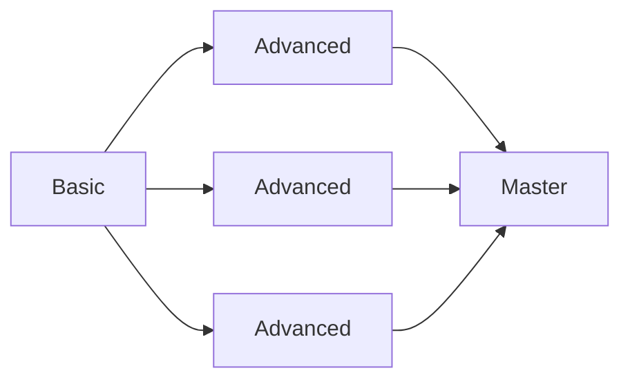
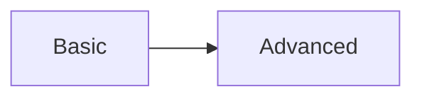

# Character Development

As you adventure, your character will become stronger. This can happen in a number of ways. When completing quests, you will gain XP. XP in this game stands for “Experience Potential”. During [[Telling-The-Story#Downtime]], you can convert XP into character development, whether it be increased skills or new training.

When you rest, based on the length of the rest, you will have time which could be spent training. Spending XP to train is either a [[Activities#Downtime Activity]] or [[Activities#Travel Activity]].

## Learning

Aside from inherent progression, the experts of the world have much to teach your character. As you travel you should learn everything you can spending your XP to gain new [[#Training|Training]].

You can learn using:

- [[Activities#Join A Guild]].
- [[Activities#Reinforcement Learning]].

When you learn something, it will become [[#Known|Known]] to you.

### Unknown

A skill or training is considered unknown if you haven't spent any XP towards learning it.

### Known

A skill or training is considered known if you have spent the required XP on it. At this point you benefit from it.

## Progression

As your characters gain [[Total-XP|Total XP]] you gain additional benefits beyond your [[#Learning|Learning]]. At 2 [[Total-XP]] and for every 4 XP you spend you can increase 1 of your [[Skills]] values by 1.

> 2, 6, 10, etc.

## Training

Basic, advanced, and master training represents powerful new abilities that your character can learn to possess. Training can either be:

- Passive - just does something all the time for you.
- Elective - gives you a new ability/option you can use at will.
- Once Per Downtime - Very powerful abilities that can only be used once before resting in a city.

### Training Tiers
Training can be split into 
#### Basic
Basic training should fundamentally be known by any practitioners of the training school. To gain a basic training you will almost always need to join the guild or organization that teaches that [[#Types Of Training|type of training]] and study under a knowledgeable practitioner. 

Basic training requires 2xp.

#### Advanced
Advanced training should be known only be those with experience, but should still be relatively ubiquitous. Taking an Advanced training requires already having a [[#Basic|Basic]] training in the [[#Training School|Training School]].

Advanced training requires 4xp.

#### Master
Taking a master training should require already having a [[#Advanced|Advanced]] training in the [[#Training School|Training School]].

Master training requires 6xp. 

### Types Of Training
There are a number of standard character archetypes and group archetypes you will run into in Aspirant. These will make up the bulk of training you can learn and have available. Some characters and groups will notably fit into more than one of these archetypes, in that case they could teach trainings from any school they fit into.

They fit into two broad categories:
#### Discipline
A discipline is a fully fleshed out school of training. Progression in a discipline will look like this:

#### Concept
A concept is a more streamlined idea, which you can obtain a basic idea of and then refine over time. Progression in a concept looks like this:

### Training School
This is a perhaps non-exhaustive list of 
#### Weapons Enthusiast
*More than just some fighter, you are a hobbyist with an interest in the workings of weapons and using them very effectively.*
#### Hunter
*A master of defeating an enemy with preparation. You believe knowledge is power when it comes to defeating an enemy.*
#### Knight
*A master of armour and defense, a knight knows how to move well in heavy armour.*
#### Commander
*Leaders with the expertise to support and coordinate their allies.*
#### Assassin
*A master of killing and stealth, specializing in using small weapons to kill.*
#### Paladin
*Holy warriors filled with faith and hope.*
#### Mercenary
*Soldiers of fortune who believe in overwhelming odds to gain victory.*
#### Arcanist
*Masters of imbuing the arcane into everything around them.*
#### Crafter
*Experts in creating things out of materials.*
#### Dynamist
*Experts in changing energy and elements, and how it flows all around us.*
#### Mystic
*Those who commune with the other side. Perceivers of things unseen.*
#### Shaper
*Sorcerers that shape the world around them.*
#### Healer
*Those who use science or superstition to cure the sick and wounded.*
#### Spymaster
*Those who shape the world from the shadows.*
#### Scholar
*Learned masters of the world.*
#### Beastmaster
*Handlers and masters of animals.*
#### Driver
*You are an expert in travel and Transportation.*
#### Trader
*You are a master of moving and haggling, bartering is your bread and butter.*
#### Burglar
*A thief by trade.*
#### Rogue
*A trickster using any advantage they can to defeat their foes.*

#### Hero
*Legends who shape the world around them.*
