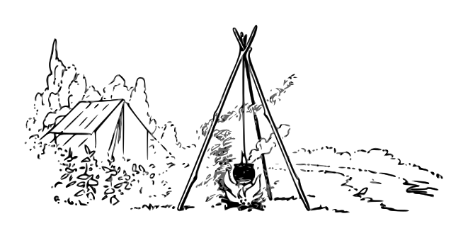

## Aspirant RPG
*A Game about Adventure and Expertise!*

Inspired by PBtA systems, classic fantasy RPGs, and worlds where all labour has value.

* Learn the [Lore](Lore).
* Learn to [How To Play](How-To-Play).
* Remember to respect the [Code Of Conduct](https://github.com/bombasticSlacks/Aspirant/blob/main/CODE_OF_CONDUCT).
* If you are going to approach difficult topics make sure that everyone has [Consented](https://www.montecookgames.com/store/product/consent-in-gaming/).

*Aspirant is currently a work in progress on a journey to become a complete game*
* It is open source under [CC BY SA 4.0](https://github.com/bombasticSlacks/Aspirant/blob/main/LICENSE) feel free to [fork](https://github.com/bombasticSlacks/Aspirant/fork) and modify.
* It is updated almost weekly with a public [changelog](https://github.com/bombasticSlacks/Aspirant/commits/main).
* It may have proposed changes you can [review](https://github.com/bombasticSlacks/Aspirant/pulls).
* A list of known [issues](https://github.com/bombasticSlacks/Aspirant/issues) is tracked you can report anything you notice.
* You can also request [features](https://github.com/bombasticSlacks/Aspirant/issues/new/choose).

Hosted By: [Dillon Matchett](https://github.com/bombasticSlacks) Licensed Under: [CC BY SA 4.0](https://github.com/bombasticSlacks/Aspirant/blob/main/LICENSE) Originally At: [GitHub](https://github.com/bombasticSlacks/Aspirant) 
